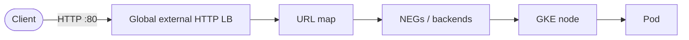
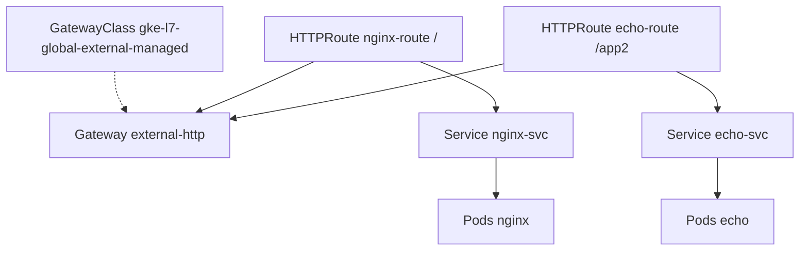
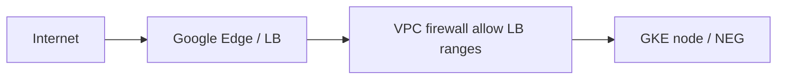

# GKE Lab: VPC, Gateway API, HTTP Routes & Sample Workloads

This document records a hands-on Google Cloud lab: building a **GKE Standard** cluster, enabling **Gateway API**, exposing workloads with a **GKE Gateway** (`gke-l7-global-external-managed`), and routing with **`HTTPRoute`**. It includes theory, steps we followed, example commands and outputs, diagrams, and **how to remove everything**.

> **Note on networking:** We designed a **custom VPC** (`gke-vpc`) and subnet for learning. The example cluster **`gke-us-east1`** described in session details was created on the **default VPC** because the cluster **Networking** screen was left on **default** during creation. To use your custom VPC, select **`gke-vpc`** and **`gke-vpc-us-east1`** at cluster create time. The Kubernetes and Gateway API steps are the same either way.

---

## Table of contents

1. [Goals and outcomes](#1-goals-and-outcomes)
2. [Concepts (theory)](#2-concepts-theory)
3. [Architecture overview](#3-architecture-overview)
4. [Prerequisites](#4-prerequisites)
5. [Part A — VPC and subnet (custom network)](#part-a--vpc-and-subnet-custom-network)
6. [Part B — Create the GKE cluster](#part-b--create-the-gke-cluster)
7. [Part C — Connect `kubectl`](#part-c--connect-kubectl)
8. [Part D — Enable Gateway API](#part-d--enable-gateway-api)
9. [Part E — First sample: Gateway + HTTPRoute + nginx](#part-e--first-sample-gateway--httproute--nginx)
10. [Part F — Second backend (echo) and path-based routing](#part-f--second-backend-echo-and-path-based-routing)
11. [Observed GatewayClasses](#observed-gatewayclasses)
12. [Firewall rules and traffic path](#12-firewall-rules-and-traffic-path)
13. [HTTPS-only (where to change)](#13-https-only-where-to-change)
14. [Troubleshooting notes](#14-troubleshooting-notes)
15. [Complete teardown (remove everything)](#15-complete-teardown-remove-everything)
16. [Reference links](#16-reference-links)

---

## 1. Goals and outcomes

| Goal | Outcome |
|------|---------|
| Custom **VPC** + **subnet** (Plan B) | `gke-vpc`, subnet in **`us-east1`**, primary range e.g. `10.0.1.0/24` |
| **GKE Standard** cluster | Example: **`gke-us-east1`**, zonal **`us-east1-b`**, **Regular** channel |
| **Gateway API** enabled | `kubectl get gatewayclass` shows GKE classes |
| **External HTTP** via **Gateway API** | `Gateway` + `HTTPRoute`, class **`gke-l7-global-external-managed`** |
| **Path-based routing** | `/` → nginx, `/app2` → http-echo (two `HTTPRoute` resources recommended) |

---

## 2. Concepts (theory)

### 2.1 AWS vs GCP mental map

| AWS idea | GCP equivalent |
|----------|----------------|
| EKS | **GKE** |
| ALB + Ingress | **GKE Gateway** / Ingress + **Cloud Load Balancing** |
| Security groups | **VPC firewall rules** (often + **network tags** on nodes) |
| Public vs private subnet | **Subnet CIDR is private (RFC1918)**; “public” usually means **VMs have external IPs** and/or **internet-facing load balancers** |

### 2.2 Subnet: “public” or “private”?

- The **subnet’s IP range** (e.g. `10.0.1.0/24`) is **private** (not routable on the public internet).
- **Public vs private for workloads** depends on **node external IPs**, **private nodes + Cloud NAT**, and **load balancer** frontends—not a single “subnet = public” toggle.

### 2.3 Gateway API vs nginx `Ingress`

| nginx Ingress | Gateway API (typical GKE split) |
|---------------|----------------------------------|
| `IngressClass` (e.g. nginx) | **`GatewayClass`** (e.g. `gke-l7-global-external-managed`) |
| `Ingress` rules (host/path → Service) | **`HTTPRoute`** (path/host → **Service**) |
| Implicit “listener” on 80/443 | **`Gateway`** declares **listeners** (ports, TLS, etc.) |

- **`GatewayClass`**: *Which* implementation / load balancer family (cluster-scoped).
- **`Gateway`**: *One* load balancer “front door” (listeners, addresses)—often shared by many routes.
- **`HTTPRoute`**: Routing rules to **Services** (`backendRefs`), attached to a **`Gateway`** via **`parentRefs`**.

### 2.4 Why two backends appear on the GCP load balancer

For GKE-managed Gateways you often see:

1. **Application backend(s)** — NEGs pointing at your **Services** (e.g. nginx, echo).
2. **Default / `serve404` backend** — used for **unmatched** paths or default URL-map behavior; may show “no backends” in UI for that bucket.

This is **expected**, not an error.

### 2.5 Why a single `HTTPRoute` with `/` and `/app2` can misbehave at first

- **Global external HTTP(S) load balancers** can take **several minutes** to update URL maps and NEGs.
- **`PathPrefix: /`** matches **all** paths; more specific paths must be **programmed** on the LB and backends must be **healthy**.
- **Splitting** into **two `HTTPRoute` objects** (one for `/app2`, one for `/`) often reconciles more clearly on GKE.

---

## 3. Architecture overview

### 3.1 High-level traffic (internet → pod)

```
Internet
    |
    v
Google Global External HTTP(S) Load Balancer  (VIP e.g. 35.190.x.x :80)
    |
    v
URL map  (paths -> backend services / NEGs)
    |
    v
GKE nodes in VPC (NEGs -> Pod IPs)
    |
    v
Pods (nginx, http-echo, ...)
```

### 3.2 Mermaid — request path



### 3.3 Mermaid — Kubernetes objects



### 3.4 ASCII — control plane vs data plane

```
+---------------------------+          +------------------------------+
|  kubectl / Cloud Console  |  HTTPS   |  GKE control plane (API)     |
|  (your laptop / Shell)    +--------->+  e.g. endpoint IP :443       |
+---------------------------+          +------------------------------+

+---------------------------+          +------------------------------+
|  Browser / curl           |  HTTP    |  External load balancer VIP  |
|  to LB IP :80             +--------->+  -> NEGs -> Pods              |
+---------------------------+          +------------------------------+
```

---

## 4. Prerequisites

- Google Cloud **project** with **billing** (trial/credit is fine).
- Enable **Kubernetes Engine API** (**APIs & Services → Library**).

Example (Cloud Shell):

```bash
gcloud services enable container.googleapis.com
```

---

## Part A — VPC and subnet (custom network)

### A.1 Console steps (summary)

1. **VPC network → VPC networks → Create VPC network**
2. **Name:** e.g. `gke-vpc`
3. **Subnet creation mode:** **Custom**
4. **Add subnet**
   - **Name:** e.g. `gke-vpc-us-east1` (avoid duplicating the VPC name for clarity)
   - **Region:** `us-east1` (match your GKE region)
   - **IP stack:** IPv4 single-stack
   - **Primary IPv4 range:** e.g. `10.0.1.0/24` (or `/20` for more headroom)
   - **Secondary IPv4 ranges:** optional at this step; GKE can **create** pod/service secondary ranges at cluster creation if you choose **automatic** IP allocation for VPC-native clusters
   - **Private Google Access:** **On** is a good default for nodes reaching Google APIs without relying on public IPs
5. **Firewall:** wizard can add default rules (SSH, RDP, ICMP, internal, deny/allow patterns)—review for lab vs production
6. **Dynamic routing:** **Regional** is typical for single-region labs
7. **Create**

### A.2 What we configured (reference)

| Item | Example value |
|------|----------------|
| VPC name | `gke-vpc` |
| Subnet name | `gke-vpc-us-east1` |
| Region | `us-east1` |
| Primary range | `10.0.1.0/24` |

---

## Part B — Create the GKE cluster

### B.1 Cluster basics (Console)

| Field | Recommended (lab) | Why |
|-------|---------------------|-----|
| **Name** | `gke-us-east1` | Descriptive |
| **Location type** | **Zonal** | Simpler / often cheaper than regional multi-zone |
| **Zone** | `us-east1-b` | Must be in **`us-east1`** if subnet is `us-east1` |
| **Default node locations** | Single zone `us-east1-b` | Avoid extra zones unless you need HA |
| **Release channel** | **Regular** | Balance of features and stability |
| **Version** | Default on channel | e.g. `1.35.x-gke...` |

**Cost note:** The console may default to **3 nodes** and **`e2-medium`**—adjust under **Node pools** if you want **1 node** or smaller machine types.

### B.2 Networking (critical)

To use **your custom VPC**:

- **Network:** `gke-vpc`
- **Subnet:** `gke-vpc-us-east1`
- **VPC-native (alias IP):** enabled
- **Pod / service secondary ranges:** **automatic** if you did not pre-create secondary ranges on the subnet

If you leave **Network: default**, the cluster uses the **default VPC** (as in the session’s cluster details)—still valid for Gateway API labs.

### B.3 Features

- Enable **Gateway API** at create time **if** the UI shows it; otherwise enable after create (Part D).

### B.4 Example cluster properties (from session)

| Property | Example |
|----------|---------|
| Mode | Standard |
| Location | Zonal `us-east1-b` |
| Nodes | 3 × `e2-medium` (default pool) |
| Cluster networking (actual) | **default** VPC / **default** subnet if custom VPC not selected |
| Gateway API (initial) | Often **Disabled** until updated |
| HTTP Load Balancing | Enabled |

---

## Part C — Connect `kubectl`

1. **Kubernetes Engine → Clusters →** your cluster → **Connect**
2. Run the **`gcloud container clusters get-credentials`** command in **Cloud Shell**

**Zonal cluster:**

```bash
gcloud container clusters get-credentials gke-us-east1 \
  --zone us-east1-b \
  --project YOUR_PROJECT_ID
```

**Verify:**

```bash
kubectl config current-context
kubectl get nodes
kubectl cluster-info
```

**Example output (abbreviated):**

```text
NAME                                                  STATUS   ROLES    AGE   VERSION
gke-gke-us-east1-default-pool-xxxxx-aaaa   Ready    <none>   10m   v1.35.x-gke...
...
```

---

## Part D — Enable Gateway API

### D.1 Console

**Kubernetes Engine → Clusters →** select cluster → **Edit** → enable **Gateway API** → **Save**.  
Status may show **RECONCILING** for several minutes—this is a **cluster-level** update, not necessarily a full rebuild.

### D.2 `gcloud` (alternative)

```bash
gcloud container clusters update gke-us-east1 \
  --zone=us-east1-b \
  --gateway-api=standard \
  --project=YOUR_PROJECT_ID
```

### D.3 Verify

```bash
kubectl get gatewayclass
```

**Example output:**

```text
NAME                               CONTROLLER                  ACCEPTED   AGE
gke-l7-global-external-managed     networking.gke.io/gateway   True       23m
gke-l7-gxlb                        networking.gke.io/gateway   True       23m
gke-l7-regional-external-managed   networking.gke.io/gateway   True       23m
gke-l7-rilb                        networking.gke.io/gateway   True       23m
```

For a **public internet** demo, use **`gke-l7-global-external-managed`**.

---

## Part E — First sample: Gateway + HTTPRoute + nginx

### E.1 Apply manifests

```bash
cat <<'EOF' | kubectl apply -f -
apiVersion: v1
kind: Namespace
metadata:
  name: demo
---
apiVersion: apps/v1
kind: Deployment
metadata:
  name: nginx
  namespace: demo
  labels:
    app: nginx
spec:
  replicas: 1
  selector:
    matchLabels:
      app: nginx
  template:
    metadata:
      labels:
        app: nginx
    spec:
      containers:
        - name: nginx
          image: nginx:1.25
          ports:
            - containerPort: 80
---
apiVersion: v1
kind: Service
metadata:
  name: nginx-svc
  namespace: demo
spec:
  type: ClusterIP
  selector:
    app: nginx
  ports:
    - port: 80
      targetPort: 80
---
apiVersion: gateway.networking.k8s.io/v1
kind: Gateway
metadata:
  name: external-http
  namespace: demo
spec:
  gatewayClassName: gke-l7-global-external-managed
  listeners:
    - name: http
      protocol: HTTP
      port: 80
---
apiVersion: gateway.networking.k8s.io/v1
kind: HTTPRoute
metadata:
  name: nginx-route
  namespace: demo
spec:
  parentRefs:
    - group: gateway.networking.k8s.io
      kind: Gateway
      name: external-http
      namespace: demo
      sectionName: http
  rules:
    - matches:
        - path:
            type: PathPrefix
            value: /
      backendRefs:
        - name: nginx-svc
          port: 80
EOF
```

**Example apply output:**

```text
namespace/demo created
deployment.apps/nginx created
service/nginx-svc created
gateway.gateway.networking.k8s.io/external-http created
httproute.gateway.networking.k8s.io/nginx-route created
```

### E.2 Wait for the Gateway address

```bash
kubectl get gateway external-http -n demo -w
```

Until **ADDRESS** is populated and **PROGRAMMED** is **True** (wording varies by version).

**Example:**

```text
NAME            CLASS                            ADDRESS         PROGRAMMED   AGE
external-http   gke-l7-global-external-managed   35.190.46.248   True         2m7s
```

### E.3 Test

```bash
curl -s http://35.190.46.248/ | head -5
```

(Replace with your **ADDRESS**.)

---

## Part F — Second backend (echo) and path-based routing

### F.1 Deploy http-echo

```bash
cat <<'EOF' | kubectl apply -f -
apiVersion: apps/v1
kind: Deployment
metadata:
  name: echo
  namespace: demo
  labels:
    app: echo
spec:
  replicas: 1
  selector:
    matchLabels:
      app: echo
  template:
    metadata:
      labels:
        app: echo
    spec:
      containers:
        - name: echo
          image: hashicorp/http-echo:0.2.3
          args:
            - "-text=Hello from backend TWO (echo)"
            - "-listen=:5678"
          ports:
            - containerPort: 5678
---
apiVersion: v1
kind: Service
metadata:
  name: echo-svc
  namespace: demo
spec:
  type: ClusterIP
  selector:
    app: echo
  ports:
    - port: 80
      targetPort: 5678
EOF
```

### F.2 Split `HTTPRoute`s (recommended on GKE)

**`nginx-route`** — only `/` → nginx:

```bash
kubectl apply -f - <<'EOF'
apiVersion: gateway.networking.k8s.io/v1
kind: HTTPRoute
metadata:
  name: nginx-route
  namespace: demo
spec:
  parentRefs:
    - group: gateway.networking.k8s.io
      kind: Gateway
      name: external-http
      namespace: demo
      sectionName: http
  rules:
    - matches:
        - path:
            type: PathPrefix
            value: /
      backendRefs:
        - name: nginx-svc
          port: 80
EOF
```

**`echo-route`** — `/app2` → echo:

```bash
kubectl apply -f - <<'EOF'
apiVersion: gateway.networking.k8s.io/v1
kind: HTTPRoute
metadata:
  name: echo-route
  namespace: demo
spec:
  parentRefs:
    - group: gateway.networking.k8s.io
      kind: Gateway
      name: external-http
      namespace: demo
      sectionName: http
  rules:
    - matches:
        - path:
            type: PathPrefix
            value: /app2
      backendRefs:
        - name: echo-svc
          port: 80
EOF
```

### F.3 Verify

```bash
curl -s http://35.190.46.248/app2
curl -s http://35.190.46.248/ | head -5
```

**Example success:**

```text
Hello from backend TWO (echo)
<!DOCTYPE html>
<html>
<head>
<title>Welcome to nginx!</title>
```

---

## Observed GatewayClasses

| Class | Typical use |
|-------|----------------|
| `gke-l7-global-external-managed` | **Global external** HTTP(S) LB — default for public internet demos |
| `gke-l7-regional-external-managed` | Regional external |
| `gke-l7-rilb` | Regional **internal** |
| `gke-l7-gxlb` | Advanced global / cross-region scenarios |

---

## 12. Firewall rules and traffic path

- **VPC firewall rules** (not AWS security groups) control **ingress/egress** to **VMs** (nodes), often via **tags** like `gke-gke-us-east1-...-node`.
- GKE creates rules for **kubelet**, **pod CIDR ↔ node**, and often **`gkegw1-...-l7-default-global`** allowing **Google LB / health-check** ranges:
  - **`35.191.0.0/16`**
  - **`130.211.0.0/22`**
- **Console:** **VPC network → Firewall rules** — filter `gke` or `gkegw`.

**Mermaid — LB to nodes**



---

## 13. HTTPS-only (where to change)

- **Primary place:** the **`Gateway`** resource — add **`HTTPS`** listener on **443**, **`tls`** termination, **certificate references** (per GKE version), and optionally **remove** the **HTTP** listener or **redirect** HTTP → HTTPS.
- **Certificates:** Certificate Manager / Google-managed certs typically require a **DNS name** pointing at the LB IP.
- **Docs:** [Configure TLS for Gateway](https://cloud.google.com/kubernetes-engine/docs/how-to/configure-gateway-resources#configure_tls), [Deploying Gateways](https://cloud.google.com/kubernetes-engine/docs/how-to/deploying-gateways).

---

## 14. Troubleshooting notes

| Symptom | Things to check |
|---------|-------------------|
| Gateway **ADDRESS** empty | Wait **5–20+** minutes; `kubectl describe gateway -n demo` |
| **`/app2`** returns **nginx 404** | **`PathPrefix /`** catches everything if not split / not propagated; use **two `HTTPRoute`s**; wait for **echo** NEG on LB |
| **HTTPRoute** accepted but wrong backend | **Global LB** propagation delay; confirm **Endpoints** `kubectl get endpoints -n demo` |
| **`kubectl` connection errors** | Zonal cluster needs **`--zone`**, not only `--region` |

---

## 15. Complete teardown (remove everything)

Order matters: delete **Kubernetes** resources that hold **load balancer** state first, then **cluster**, then **VPC** (if unused).

### 15.1 Delete Gateway API and workloads (namespace)

This removes **`HTTPRoute`**, **`Gateway`**, **Services**, **Deployments**, and releases the **external load balancer** (may take several minutes).

```bash
# Ensure correct context
kubectl config current-context

# Delete the whole demo namespace (cascades most objects)
kubectl delete namespace demo
```

If you prefer explicit order:

```bash
kubectl delete httproute --all -n demo
kubectl delete gateway external-http -n demo
kubectl delete deployment,service --all -n demo
kubectl delete namespace demo
```

Wait until **`kubectl get gateway -A`** shows nothing in `demo` and Cloud Console **Network Services → Load balancing** no longer lists the **GKE-managed** LB (or it is **deleting**).

### 15.2 Delete the GKE cluster

**Console:** **Kubernetes Engine → Clusters →** cluster → **Delete**.

**`gcloud`:**

```bash
gcloud container clusters delete gke-us-east1 \
  --zone=us-east1-b \
  --project=YOUR_PROJECT_ID
```

### 15.3 Optional: delete custom VPC

Only if **no** other resources use it:

1. **VPC network → VPC networks →** `gke-vpc` → **Delete**
2. If blocked, delete **subnet(s)**, **static IPs**, **firewall rules** referencing the network, **peerings**, etc., first.

**`gcloud` sketch (destructive):**

```bash
# List subnets
gcloud compute networks subnets list --network=gke-vpc

# Delete subnet(s)
gcloud compute networks subnets delete gke-vpc-us-east1 --region=us-east1

# Delete VPC
gcloud compute networks delete gke-vpc
```

### 15.4 Default VPC note

If the cluster used **`default`** VPC, **do not** delete **`default`** unless you understand project impact—usually you only **delete the cluster** and optional **static IPs** / **forwarding rules** left behind.

### 15.5 Verify cleanup

```bash
gcloud container clusters list --project=YOUR_PROJECT_ID
gcloud compute forwarding-rules list --global
gcloud compute addresses list --global
```

---

## 16. Reference links

- [Kubernetes Engine — Deploying Gateways](https://cloud.google.com/kubernetes-engine/docs/how-to/deploying-gateways)
- [Gateway API on GKE (concepts)](https://cloud.google.com/kubernetes-engine/docs/concepts/gateway-api)
- [Configure TLS for Gateway resources](https://cloud.google.com/kubernetes-engine/docs/how-to/configure-gateway-resources#configure_tls)
- [GKE firewall rules (concepts)](https://cloud.google.com/kubernetes-engine/docs/concepts/firewall-rules)

---

*Document generated from the GKE + Gateway API lab walkthrough. Replace IPs, project IDs, and names with your environment’s values when recreating.*
